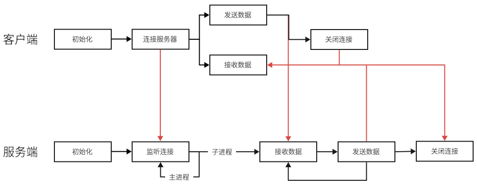

# Echo Server

### 功能
- 客户端：连接服务器，发送数据
- 服务端：接收客户端数据，原封不动发回（支持多客户端同时连接）

### 流程



### 运行结果
```text
# 注意到不同的进程
client1:
    Connect to server
    pid 21866 sent data: hello(client1)
    pid 21865 receive data: hello(client1)
    pid 21866 sent data: Quit
    server disconnect

client2:
    Connect to server
    pid 21911 sent data: hello(client2)
    pid 21910 receive data: hello(client2)
    pid 21911 sent data: Quit
    server disconnect

server:
    Server is running!
    A connection from 127.0.0.1
    A connection from 127.0.0.1
    pid 21867 Receive data: hello(client1)
    pid 21912 Receive data: hello(client2)
    pid 21867 disconnect
    process id: 21867 done.
    pid 21912 disconnect
    process id: 21912 done.
```