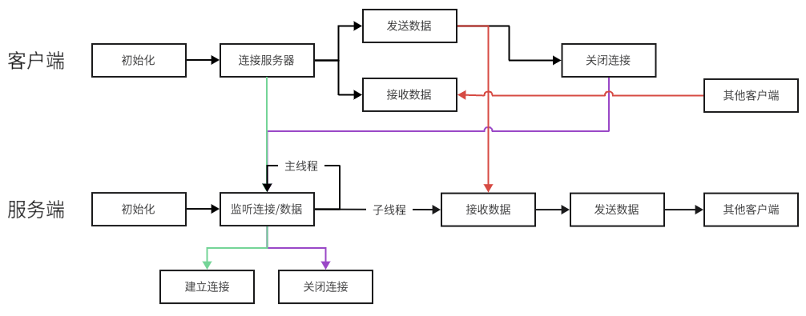

# Echo Server

### 功能
- 客户端：连接服务器，发送数据
- 服务端：接收客户端数据，向其他所有客户端广播

### 流程



### 运行结果
```text
client1:
    Your name: Bob
    Connect to server
    Hello
    [Alice]: Hi!
    [Tom]: Great

client2:
    Your name: Alice
    Connect to server
    [Bob]: Hello
    Hi!
    [Tom]: Great

client3:
    Your name: Tom
    Connect to server
    [Bob]: Hello
    [Alice]: Hi!
    Great

server:
    Server is running!
    [socket 5] connect
    [socket 6] connect
    [socket 7] connect
    [Bob]: Hello
    [Alice]: Hi!
    [Tom]: Great
    [socket 5] disconnect
    [socket 6] disconnect
    [socket 7] disconnect
```