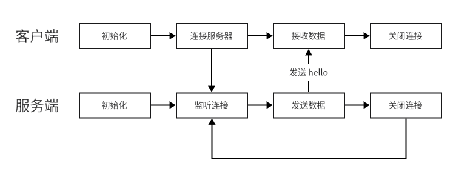

# Hello Server

### 功能
- 服务端：向客户端发送 hello
- 客户端：连接服务器，接收数据

### 流程



### 运行结果
```text
client:
    Connect to server
    Receive data: hello, welcome to my server!

server:
    Server is running!
    A connection from 127.0.0.1
    Disconnect 127.0.0.1
```