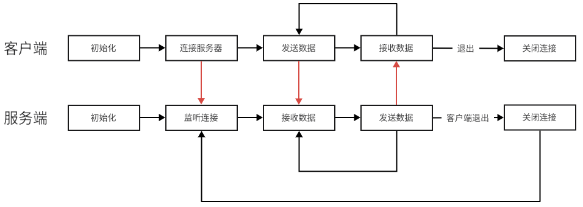

# Echo Server

### 功能
- 客户端：连接服务器，发送数据
- 服务端：接收客户端数据，原封不动发回

### 流程



### 运行结果
```text
client:
    Connect to server
    Sent data: hello
    Receive data: hello
    Sent data: Quit

server:
    Server is running!
    A connection from 127.0.0.1
    Receive data: hello
    Disconnect 127.0.0.1
```