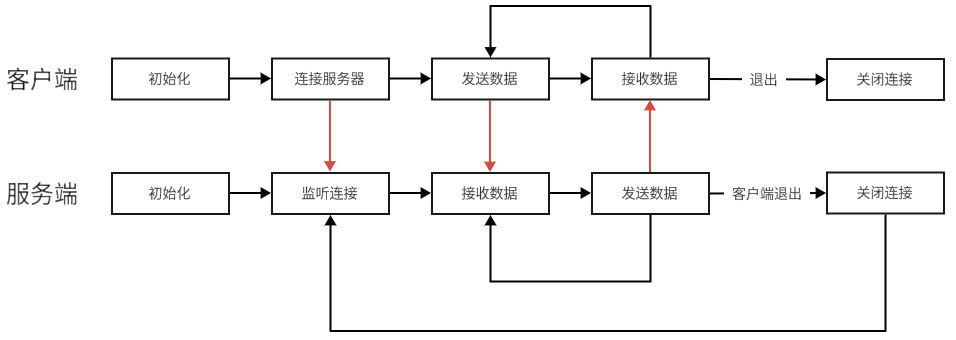

# Calculator Server

### 功能
- 客户端：连接服务器，发送数据
- 服务端：接收客户端数据，计算后返回

### 流程



### 运行结果
```text
client:
    Connect to server
    Operand count: 3
    Operand 1: 1
    Operand 2: 2
    Operand 3: 3
    Operator: +
    Result: 6
    Operand count: 0

server:
    Server is running!
    A connection from 127.0.0.1
    data 1: 1
    data 2: 2
    data 3: 3
    operator: +
    result: 6
    Disconnect 127.0.0.1
```