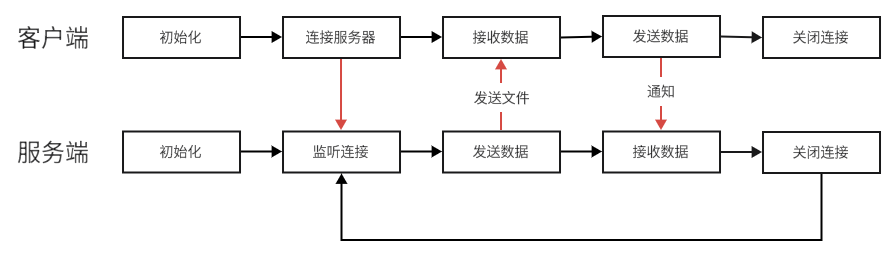

# File Server

### 功能
- 客户端：连接服务器，接收文件，通知服务器下载完成
- 服务端：向客户端发送文件

### 流程



### 运行结果
```text
client:
    Connect to server
    File download succeeded!(size: 16528)

    ~$ ./hello_client
    Hello World!
    
server:
    Server is running!
    A connection from 127.0.0.1
    Send file...(size: 16528)
    Receive data: File download succeeded!
    Disconnect 127.0.0.1
```