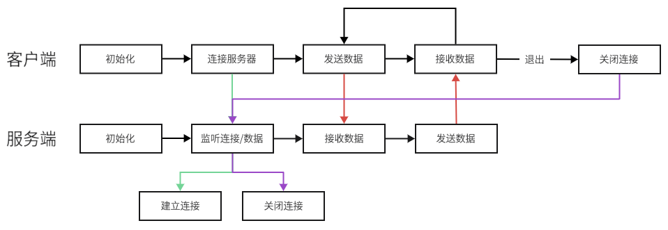

# Echo Server

### 功能
- 客户端：连接服务器，发送数据
- 服务端：接收客户端数据，原封不动发回（支持多客户端同时连接）

### 流程



### 运行结果
```text
client1:
    Connect to server
    Sent data: hello(client1)
    Receive data: hello(client1)
    Sent data: Quit

client2:
    Connect to server
    Sent data: hello(client2)
    Receive data: hello(client2)
    Sent data: Quit

server:
    Server is running!
    [socket 4] connect
    [socket 5] connect
    [socket 4] receive data: hello(client1)
    [socket 5] receive data: hello(client2)
    [socket 5] receive data: Quit
    [socket 5] disconnect
    [socket 4] receive data: Quit
    [socket 4] disconnect
```